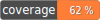

# inquirer-php


```php
<?php

namespace Aaron\InquirerPhp;

require_once __DIR__ . '/../vendor/autoload.php';

$cli = new Cli();

$questions = [
    new Question\Text('name', 'What\'s your name?'),
    new Question\Confirm('continue', 'Should we continue?'),
    new Question\Select('tshirt_size', 'What\'s your t-shirt size?', ['s', 'm', 'l', 'xl']),
];

$answers = $cli->prompt($questions);

var_dump($answers);
```
